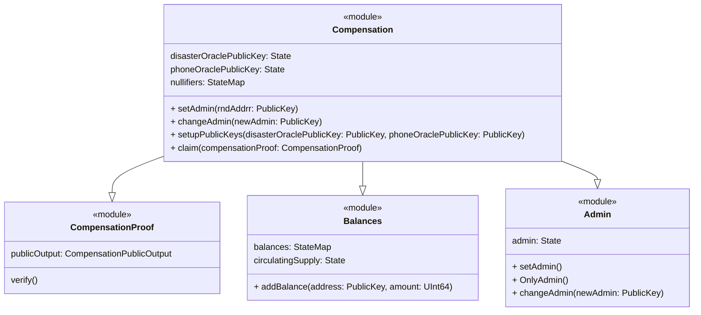
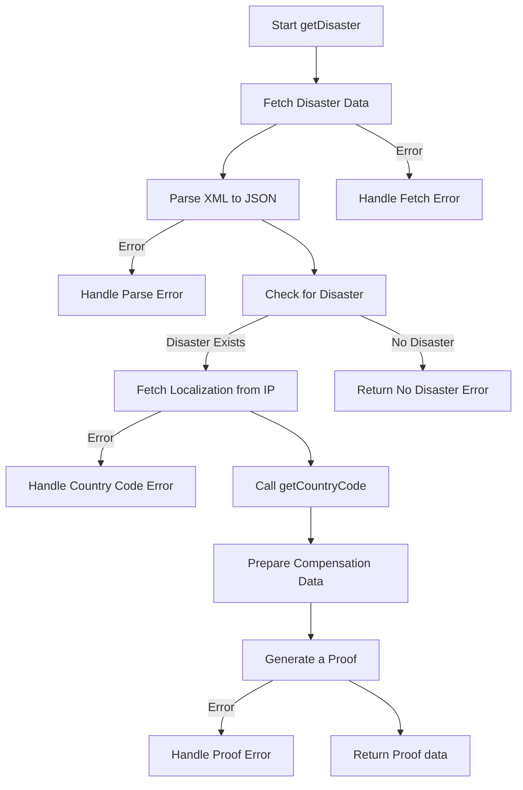
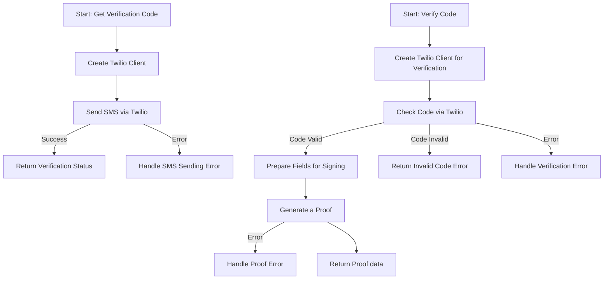

<table style="border-collapse: collapse; width: 100%;">
  <tr>
    <!-- First Image -->
    <td style="border: none;">
      
    </td>
  </tr>
</table>
<table style="border-collapse: collapse; width: 100%;">
  <tr>
    <!-- First Image -->
    <td style="border: none;">
      
    </td>
  </tr>
</table>

This document provides an overview of the project architecture and components. In addition, presentation slides are available at https://docs.google.com/presentation/d/1a1a2Ibf6whsyljMr2E5qtEDeD1yQ709n2UzVDbmQD9U.

## Short Description
Our project enables fast post-disaster financial assistance via cryptocurrency, ensuring end-to-end privacy with zero knowledge proof. By focusing on scalability, digital and financial inclusion, we are leveraging web3 technologies to support those who have lost everything.

## DescriptionGo
### PRENDICO: Privacy-Enabled Disaster Compensation
PRENDICO is an acronym for "Privacy-enabled Disaster Compensation,". It is an innovative solution after disasters. This project synergizes blockchain technology, privacy tools, and financial inclusion to deliver compensation privately to individuals affected by natural disasters.

Privacy Commitment:
At the core of PRENDICO is a commitment to privacy. Leveraging cryptographic techniques, notably zero-knowledge proof, we ensure the confidentiality of aid recipients' personal information. This privacy-centric approach shields individuals from potential vulnerabilities, guaranteeing the discreet delivery of financial assistance. One feature of PRENDICO is its ability to automatically trigger compensation transfers in case of important climate events: hurricane, flood, or any other disaster. Our system acts promptly, ensuring aid reaches those in need precisely when they need it most. Powered by a decentralized blockchain infrastructure, PRENDICO utilizes smart contracts and the lightweight Mina blockchain for automated and transparent fund distribution. This guarantees the efficiency of compensation transfers and establishes a trustless, auditable system, enhancing accountability and transparency.

Prioritizing financial inclusion, PRENDICO extends support to unbanked or underbanked populations, ensuring everyone has access to the compensation they deserve. Our user-friendly interface, built on web3 technologies, promotes digital inclusion, making the compensation process accessible to individuals with low levels of digital literacy. Anyone with a phone number and internet access can benefit from our services.

PRENDICO aims not only to deliver compensation efficiently but also to redefine standards in disaster relief, providing a beacon of hope and support for those navigating the challenging journey of recovery.

## How It's Made
As mentioned PRENDICO involves different technologies to create a seamless and secure experience for users seeking disaster compensation. The heart of user interaction lies in the ZK Dapp, where individuals connect to initiate the compensation process. 

Victims can access the service only using a smartphone. The main UI (built with NextJS) can be accessed from the browser of the device, hence low internet is not an issue.
To claim compensation, a two-step identity verification process is implemented, which involves verifying a phone number through a 1st REST API, the Phone Number Verification API. This step makes it difficult for a bad actor to request claims multiple times. 
The next step for a victim is to request eligibility for a disaster on a 2nd REST API, the Global Disaster Alert and Coordination System API (GDACS API). This service locates the user, verifies its eligibility to current disaster and specifies the amount of compensation, based on price life index and severity of the disaster.
It is preferable to have 2 different APIs, to avoid a bad actor to be able to correlate full user identity if hacking one monolithic API.
Each API has its own private key, and all responses are signed with it.
To receive funds securely, users are required to create an Auro Wallet, compatible with the Mina Blockchain.
The Mina blockchain is chosen for its privacy feature.
The victim has to locally generate a ZK proof that both APIs replied successfully and that response signatures are properly signed with public keys whitelisted in Mina L2 runtime contract.
The locally computed proof is then sent to the Mina runtime contract. If the proof is valid, and if public outputs of the proof (public keys, ..) match current states in the contract, the claim is nullified to avoid double spending, and the compensation is sent to the public address of the victim.

Build for : 

Powered by : 

---

This structure maintains a comprehensive overview of your project, highlighting its key aspects, privacy commitment, technological integration, and innovative solutions.

## System Components

### Protokit App Chain

### Disaster API 

### Phone Number api

## Disaster API Overview
The Disaster API, developed using NestJS, is tailored to offer prompt responses and potential compensation in regions impacted by natural disasters. It employs external data sources for disaster information and cryptographic techniques for secured responses.

### Endpoints

- **`GET /disaster`**: This endpoint assesses if a user, identified by their IP address and session ID, is in an area affected by a disaster. It fetches and analyzes disaster data from external sources, applying set criteria, and provides a digitally-signed response based on these findings.

### Core Functions

- **`getDisaster`**: Orchestrates the process of disaster detection and response preparation. It involves fetching and parsing disaster data, checking for disasters, fetching localization from IP, and preparing and signing compensation data.
- **`getCountryCode`**: Determines the user's country code based on their IP address, essential in the disaster validation process.
- **`signFields`**: Ensures the integrity and authenticity of the response by generating a digital signature.

## Phone API Overview
The Phone API, also built with NestJS, now integrates with Twilio for enhanced phone number verification and authentication, ensuring secure user interactions.

### Endpoints

- **`GET /verificationcode`**: Initiates the phone number verification process. It sends an SMS with a verification code to the provided phone number using Twilio's services.
- **`GET /verifycode`**: This endpoint validates the received verification code against Twilio's records and, if successful, generates a digitally signed response.

### Core Functions

- **`getVerificationCode`**: Utilizes Twilio to send a verification code via SMS to the user's phone number, marking the beginning of the verification process.
- **`verifyCode`**: Validates the submitted verification code with Twilio. Upon successful validation, it prepares and signs a response containing user session data.
- **`signFields`**: Generates a digital signature for the verification data, leveraging the Mina Signer client to ensure security and reliability.

### Interaction Between Components

