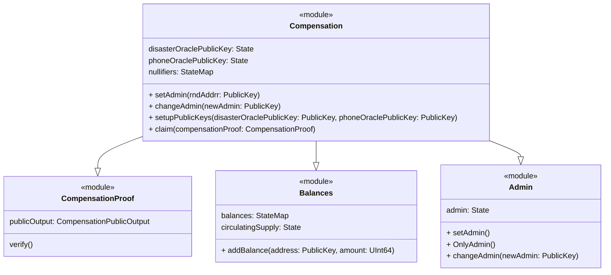
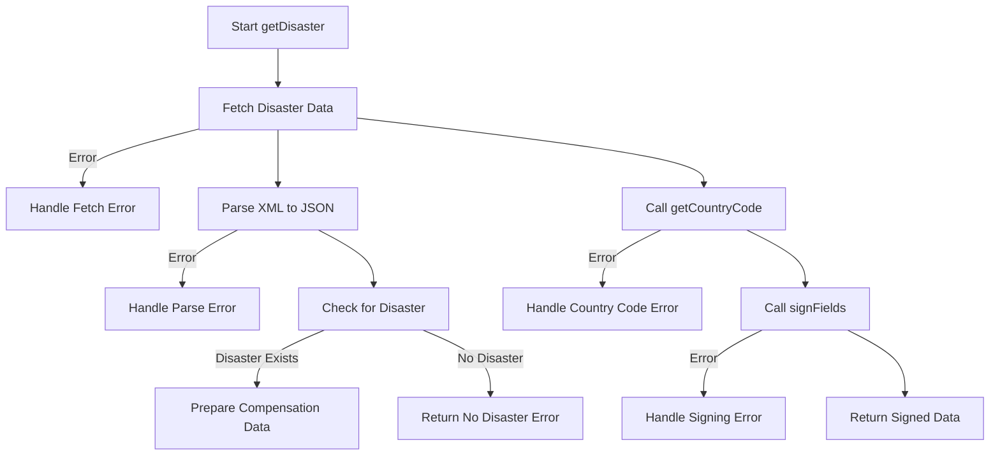
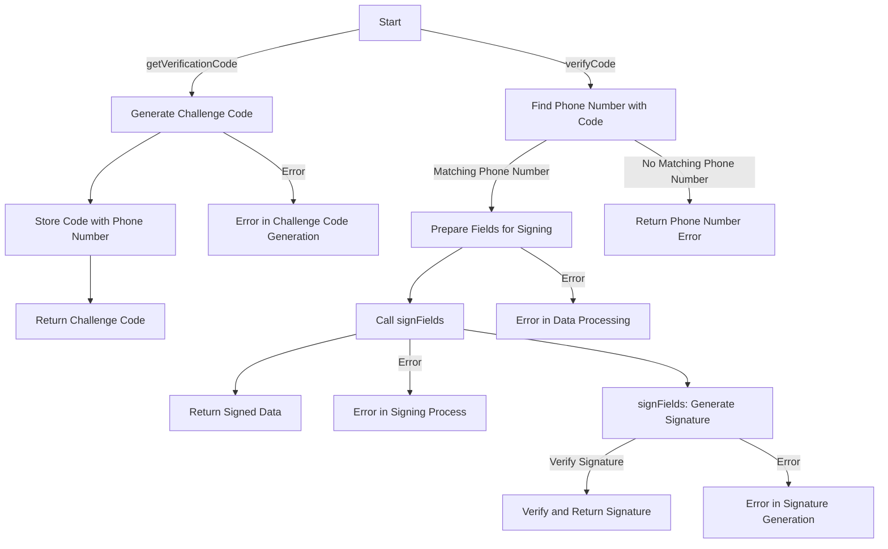
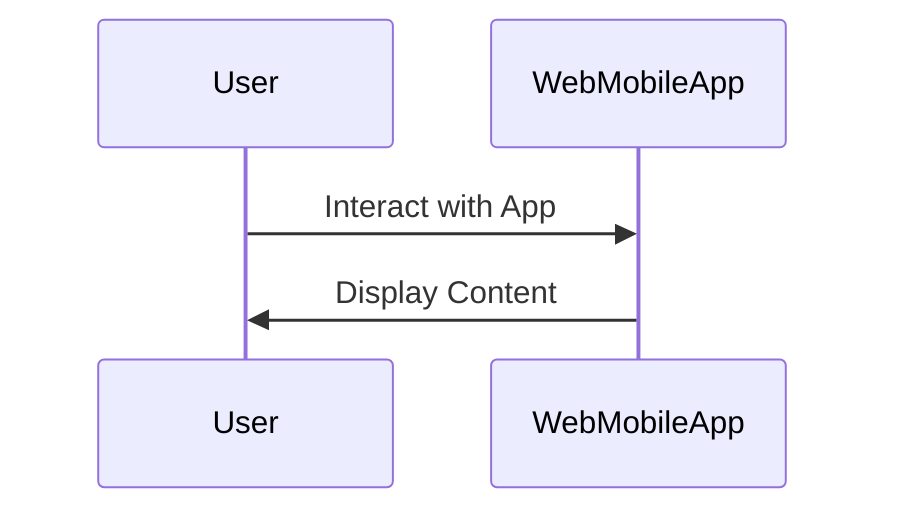
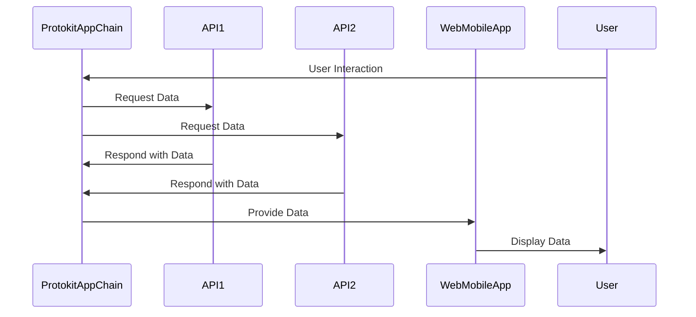

# Project Overview

This document provides an overview of the project architecture and components.

Here's how you can integrate the provided descriptions into your README:

---

## Short Description
Our project provides a quick post-disaster financial assistance via cryptocurrency, ensuring end-to-end privacy with zero knowledge proof. By focusing on scalability, digital and financial inclusion, we are leveraging web3 technologies to comprehensively support those who have lost everything.

## DescriptionGo
### PRENDICO: Privacy-Enabled Disaster Compensation
PRENDICO spearheads innovative solutions in disaster relief. This groundbreaking project synergizes blockchain technology, privacy tools, and financial inclusion to deliver swift and secure compensation to individuals affected by natural disasters.

Privacy Commitment:
At the core of PRENDICO is an unwavering commitment to privacy. Leveraging advanced cryptographic techniques, notably zero-knowledge proof, we ensure the confidentiality of aid recipients' personal information. This privacy-centric approach shields individuals from potential vulnerabilities, guaranteeing the discreet delivery of financial assistance.A standout feature of PRENDICO is its ability to automatically trigger compensation transfers in the aftermath of adverse climate events—be it a hurricane, flood, or any other disaster. Our system acts promptly, ensuring aid reaches those in need precisely when they need it most. Powered by a decentralized blockchain infrastructure, PRENDICO utilizes smart contracts and the lightweight Mina blockchain for automated and transparent fund distribution. This guarantees the efficiency of compensation transfers and establishes a trustless, auditable system, enhancing accountability and transparency.

Prioritizing financial inclusion, PRENDICO extends support to unbanked or underbanked populations, ensuring everyone has access to the compensation they deserve. Our user-friendly interface, built on web3 technologies, promotes digital inclusion, making the compensation process accessible to individuals with varying levels of digital literacy. Anyone with a phone number and internet access can benefit from our services.PRENDICO goes beyond conventional financial aid, recognizing the multifaceted challenges faced by individuals affected by disasters. The project is designed to provide comprehensive support, offering access to resources, information, and community networks. Through these additional avenues, we empower individuals in rebuilding their lives after a disaster.

PRENDICO aims not only to deliver compensation efficiently but also to redefine standards in disaster relief, providing a beacon of hope and support for those navigating the challenging journey of recovery.

## How It's Made
The development of PRENDICO involved a meticulous process, integrating various technologies to create a seamless and secure experience for users seeking disaster compensation.The heart of user interaction lies in the ZKDapp, where individuals connect to initiate the compensation process. This decentralized application streamlines the user experience, making it accessible and user-friendly.

The project's user interface is built on NextJS, providing a responsive and intuitive platform for users to validate their eligibility for financial compensation. This framework enables dynamic user interactions, ensuring a smooth onboarding process.To receive funds securely, users are required to create an Auro Wallet, compatible with the Mina Blockchain. This integration facilitates the decentralized storage of funds, ensuring transparency and security in financial transactions.
To establish the user's eligibility, a two-step identity verification process is implemented. The user creates an identity wallet, and a challenge is presented – entering a phone number, receiving a code, and confirming ownership by inputting the code in the UI. Our Identity API validates this step and generate a proof with its private Key, ensuring a secure and accurate verification process.
The next crucial step involves proving the user's presence in a disaster zone. Utilizing the GDACS API, the system locates the user and verifies its eligibility. A cryptographic proof is also generated, signed with the API's private key, ensuring that the user is genuinely within a disaster zone. The lightweight Mina Blockchain, with its Zero-Knowledge proof capabilities, securely stores and verifies these proofs, maintaining the anonymity of the victim.

The culmination of this process occurs within a smart contract on the Mina Blockchain. The system verifies both proofs using their public keys, ensuring the integrity of the information. If the aggregation of these details is accurate, the financial transfer is executed, providing compensation to the eligible individual.
Hacky Innovations:
While maintaining the highest standards of security and privacy, we embraced innovative solutions. Notably, the use of Mina Blockchain's lightweight design allowed us to ensure efficient and scalable operations, enhancing the overall performance of the compensation process.
---

This structure maintains a comprehensive overview of your project, highlighting its key aspects, privacy commitment, technological integration, and innovative solutions.

## System Components

### Protokit App Chain

### Disaster API 

### Phone Number api

## Disaster API Overview

The Disaster API, built with NestJS, provides disaster-related responses and potential compensation based on the user's location. It fetches disaster data from external sources and uses cryptographic methods for secure responses.

### Endpoints

- **`GET /disaster`**: Determines if a user is in a disaster-affected region using their IP and session ID. It fetches external disaster data, verifies against set criteria, and returns a digitally-signed response.

### Core Functions

- **`getDisaster`**: Checks for disasters in the user's location, prepares a response with session and disaster details, and signs it for security.
- **`getCountryCode`**: Retrieves the user's country from their IP address.
- **`signFields`**: Generates a digital signature for the response, ensuring data integrity and authenticity.

## Phone API Overview

The Phone API, created with NestJS, manages phone number verification and authentication.

### Endpoints

- **`GET /verificationcode`**: Initiates phone verification by generating and storing a challenge code for a given phone number.
- **`GET /verifycode`**: Verifies the received challenge code against the stored one, and generates a signed response for successful matches.

### Core Functions

- **`getVerificationCode`**: Generates a verification code for a phone number.
- **`verifyCode`**: Checks the verification code and returns a signed response upon successful validation.
- **`signFields`**: Creates a digital signature using the user's session data and Mina Signer client.

### Web/Mobile App

### Interaction Between Components

