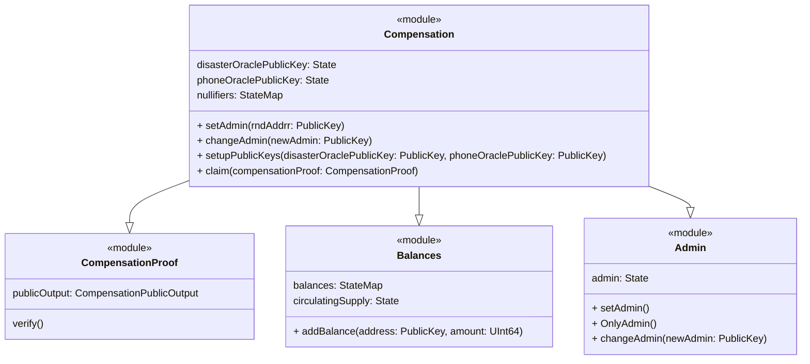
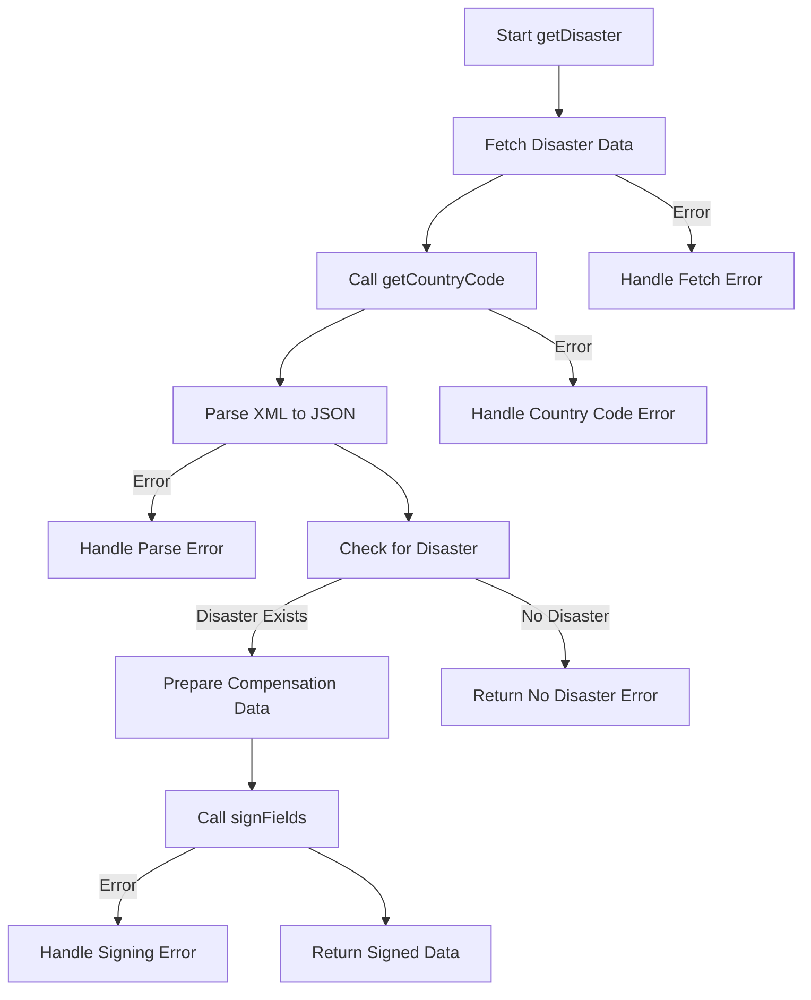
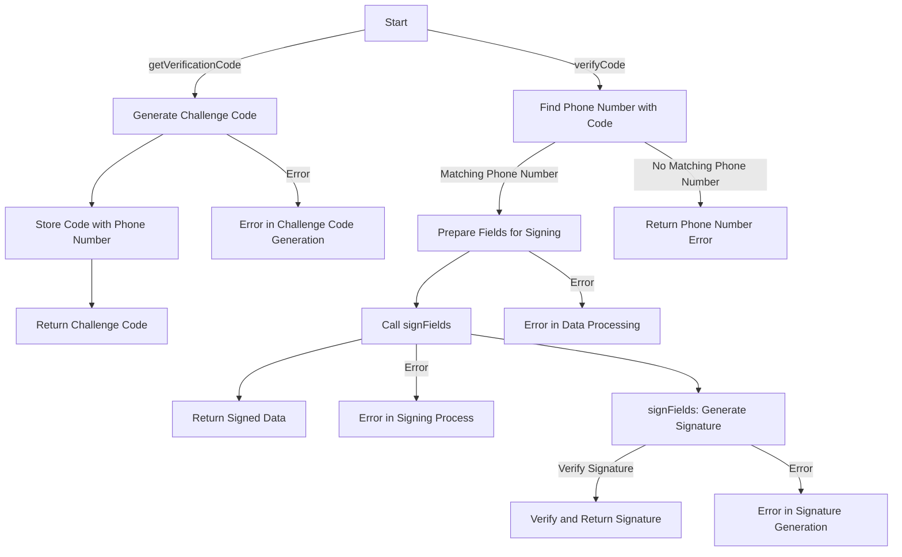
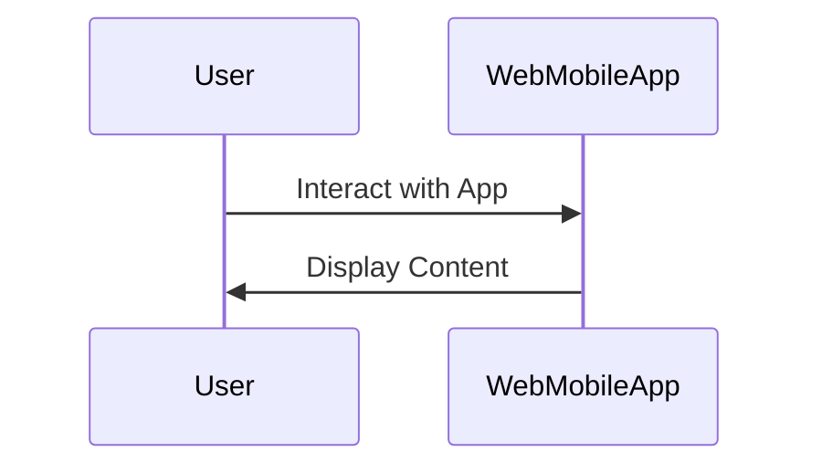
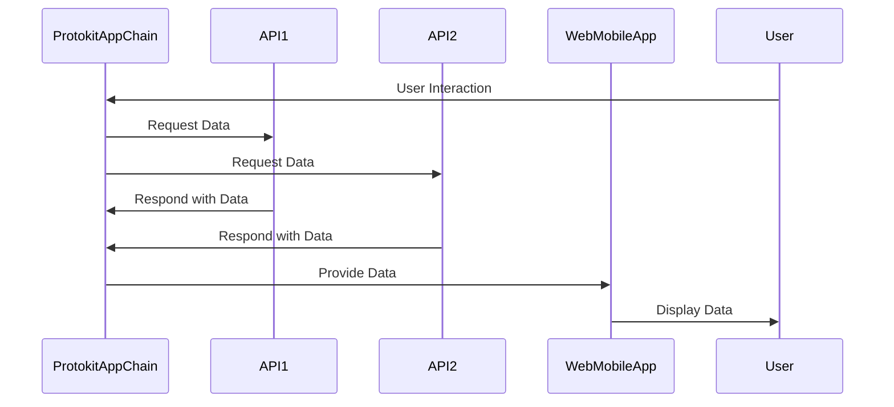

<table style="border-collapse: collapse; width: 100%;">
  <tr>
    <!-- First Image -->
    <td style="border: none;">
      
    </td>
    <td style="border: none;">
      
    </td>
  </tr>
</table>

# PRENDICO: Privacy-Enabled Disaster Compensation

This document provides an overview of the project architecture and components.

Here's how you can integrate the provided descriptions into your README:

---

## Short Description
Our project enables fast post-disaster financial assistance via cryptocurrency, ensuring end-to-end privacy with zero knowledge proof. By focusing on scalability, digital and financial inclusion, we are leveraging web3 technologies to support those who have lost everything.

## DescriptionGo
### PRENDICO: Privacy-Enabled Disaster Compensation
PRENDICO is an acronym for "Privacy-enabled Disaster Compensation,". It is an innovative solution after disasters. This project synergizes blockchain technology, privacy tools, and financial inclusion to deliver compensation privately to individuals affected by natural disasters.

Privacy Commitment:
At the core of PRENDICO is a commitment to privacy. Leveraging cryptographic techniques, notably zero-knowledge proof, we ensure the confidentiality of aid recipients' personal information. This privacy-centric approach shields individuals from potential vulnerabilities, guaranteeing the discreet delivery of financial assistance. One feature of PRENDICO is its ability to automatically trigger compensation transfers in case of important climate events: hurricane, flood, or any other disaster. Our system acts promptly, ensuring aid reaches those in need precisely when they need it most. Powered by a decentralized blockchain infrastructure, PRENDICO utilizes smart contracts and the lightweight Mina blockchain for automated and transparent fund distribution. This guarantees the efficiency of compensation transfers and establishes a trustless, auditable system, enhancing accountability and transparency.

Prioritizing financial inclusion, PRENDICO extends support to unbanked or underbanked populations, ensuring everyone has access to the compensation they deserve. Our user-friendly interface, built on web3 technologies, promotes digital inclusion, making the compensation process accessible to individuals with low levels of digital literacy. Anyone with a phone number and internet access can benefit from our services.

PRENDICO aims not only to deliver compensation efficiently but also to redefine standards in disaster relief, providing a beacon of hope and support for those navigating the challenging journey of recovery.

## How It's Made
As mentioned PRENDICO involves different technologies to create a seamless and secure experience for users seeking disaster compensation. The heart of user interaction lies in the ZK Dapp, where individuals connect to initiate the compensation process. 

Victims can access the service only using a smartphone. The main UI (built with NextJS) can be accessed from the browser of the device, hence low internet is not an issue.
To claim compensation, a two-step identity verification process is implemented, which involves verifying a phone number through a 1st REST API, the Phone Number Verification API. This step makes it difficult for a bad actor to request claims multiple times. 
The next step for a victim is to request eligibility for a disaster on a 2nd REST API, the Global Disaster Alert and Coordination System API (GDACS API). This service locates the user, verifies its eligibility to current disaster and specifies the amount of compensation, based on price life index and severity of the disaster.
It is preferable to have 2 different APIs, to avoid a bad actor to be able to correlate full user identity if hacking one monolithic API.
Each API has its own private key, and all responses are signed with it.
To receive funds securely, users are required to create an Auro Wallet, compatible with the Mina Blockchain.
The Mina blockchain is chosen for its privacy feature.
The victim has to locally generate a ZK proof that both APIs replied successfully and that response signatures are properly signed with public keys whitelisted in Mina L2 runtime contract.
The locally computed proof is then sent to the Mina runtime contract. If the proof is valid, and if public outputs of the proof (public keys, ..) match current states in the contract, the claim is nullified to avoid double spending, and the compensation is sent to the public address of the victim.

Build for : 

Powered by : 

---

This structure maintains a comprehensive overview of your project, highlighting its key aspects, privacy commitment, technological integration, and innovative solutions.

## System Components

### Protokit App Chain

### Disaster API 

### Phone Number api

## Disaster API Overview

The Disaster API, built with NestJS, provides disaster-related responses and potential compensation based on the user's location. It fetches disaster data from external sources and uses cryptographic methods for secure responses.

### Endpoints

- **`GET /disaster`**: Determines if a user is in a disaster-affected region using their IP and session ID. It fetches external disaster data, verifies against set criteria, and returns a digitally-signed response.

### Core Functions

- **`getDisaster`**: Checks for disasters in the user's location, prepares a response with session and disaster details, and signs it for security.
- **`getCountryCode`**: Retrieves the user's country from their IP address.
- **`signFields`**: Generates a digital signature for the response, ensuring data integrity and authenticity.

## Phone API Overview

The Phone API, created with NestJS, manages phone number verification and authentication.

### Endpoints

- **`GET /verificationcode`**: Initiates phone verification by generating and storing a challenge code for a given phone number.
- **`GET /verifycode`**: Verifies the received challenge code against the stored one, and generates a signed response for successful matches.

### Core Functions

- **`getVerificationCode`**: Generates a verification code for a phone number.
- **`verifyCode`**: Checks the verification code and returns a signed response upon successful validation.
- **`signFields`**: Creates a digital signature using the user's session data and Mina Signer client.

### Web/Mobile App
//TODO

### Interaction Between Components
//TODO

