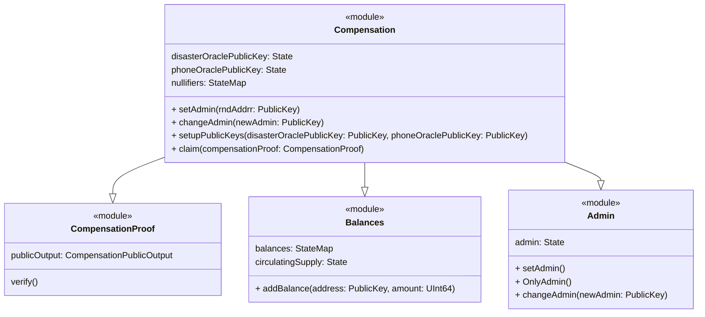
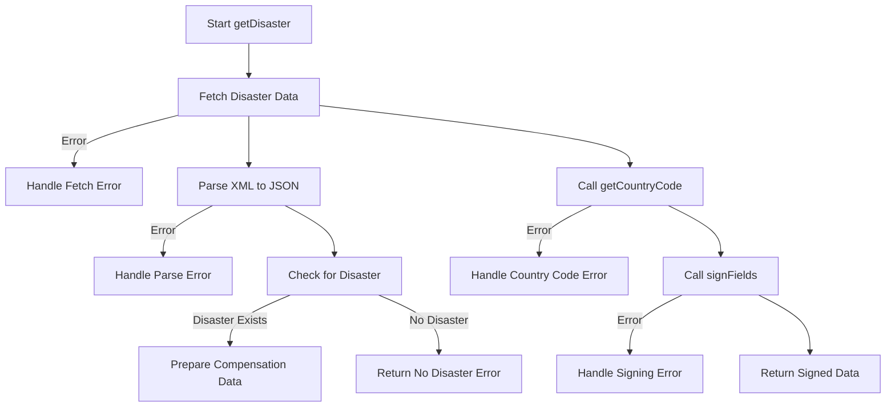
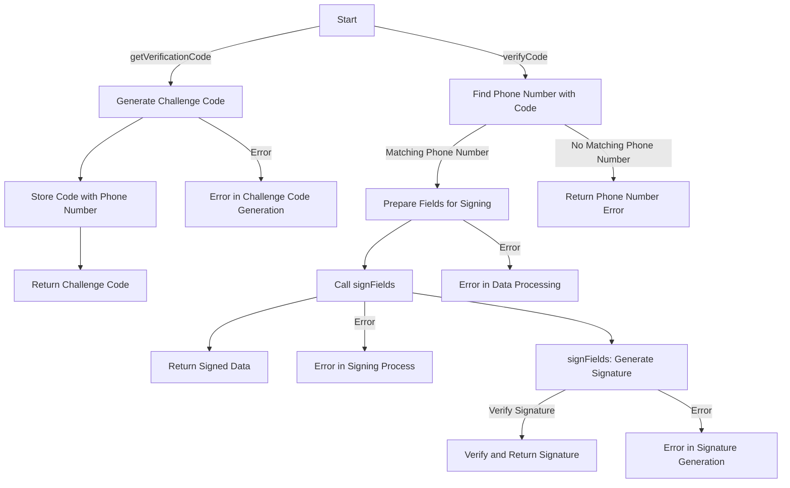
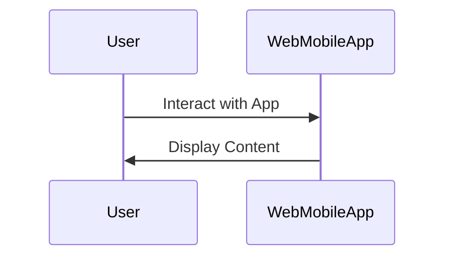
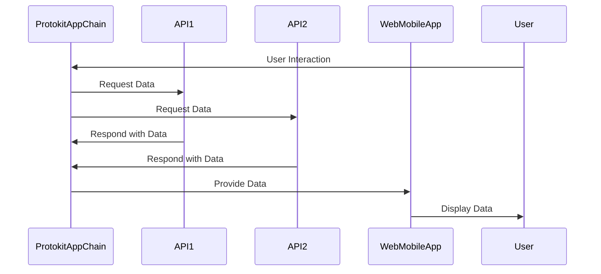

# Project Overview

This document provides an overview of the project architecture and components.

## System Components

### Protokit App Chain

### Disaster API 

### Phone Number api

### Web/Mobile App

### Interaction Between Components

## Disaster API Overview

The Disaster API, created using NestJS, is designed to provide responses and potential compensation in case of disasters, based on the user's geographic location. It utilizes external data sources to identify disasters and leverages cryptographic operations for security purposes.

### Endpoints

- **`GET /disaster` (getDisaster)**: This endpoint is the core of the API, designed to determine if a user, identified by their IP address and session ID, is in a region affected by a disaster. Upon receiving a request, the API fetches disaster information from an external source, checks if the disaster level matches predefined criteria, and if so, proceeds to create a response including a digital signature.

### Core Service Functions

- **`getDisaster`**: This function orchestrates the disaster checking process. It first retrieves the country code based on the user's IP address, then fetches disaster data from an external source (in this case, 'gdacs.org'). If a disaster matching the specified criteria (like a particular alert level) is found in the user's country, the function prepares a response including the user's session ID, disaster ID, a random salt, and a compensation amount. This response is then signed using `signFields`.

- **`getCountryCode`**: A helper function that fetches the user's country based on their IP address. This function is crucial in determining whether the user is located in a region affected by a disaster.

- **`signFields`**: This function is used to generate a digital signature for the response data. It takes the user session ID, disaster ID, compensation amount, and a salt value, and signs them using a private key. This signature ensures the authenticity and integrity of the response.

## Phone API Overview

The Phone API, built using NestJS, offers a simple yet secure way to handle phone number verification and authentication processes.

### Endpoints

- **`GET /verificationcode` (getVerificationCode)**: This endpoint initiates the phone number verification process. When a phone number is provided as a query parameter, the API generates a random challenge code (verification code) and temporarily stores it alongside the phone number. The challenge code is typically sent to the user's phone via SMS (not implemented in the current script). The response includes the generated challenge code for further processing.

- **`GET /verifycode` (verifyCode)**: This endpoint is used for verifying the challenge code received by the user. It requires the phone number, the verification code received by the user, and a user session ID as query parameters. The API checks if the provided verification code matches the one stored for the given phone number. If the match is successful, the API proceeds to generate a digital signature using the `signFields` method in `AppService`, which includes the user session ID, phone number, and a randomly generated salt. The final response includes these fields along with the generated signature.

### Core Service Functions
  
- **`getVerificationCode`**: Generates and stores a challenge code for a given phone number and returns this code.

- **`verifyCode`**: Validates the provided verification code against the stored one. On success, it generates a response including a digital signature for the session.

- **`signFields`**: This function, used within `verifyCode`, generates a digital signature based on the user's session ID, phone number, and a salt value. It leverages the Mina Signer client for cryptographic operations.