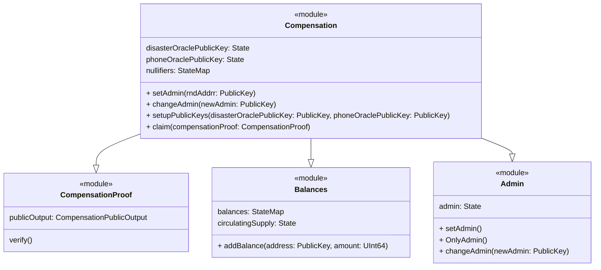
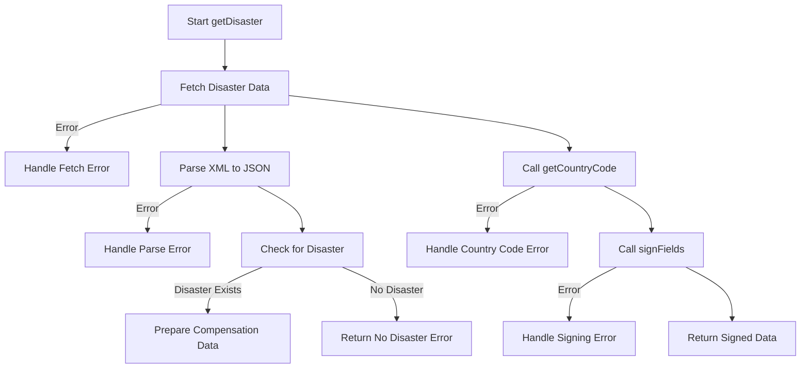
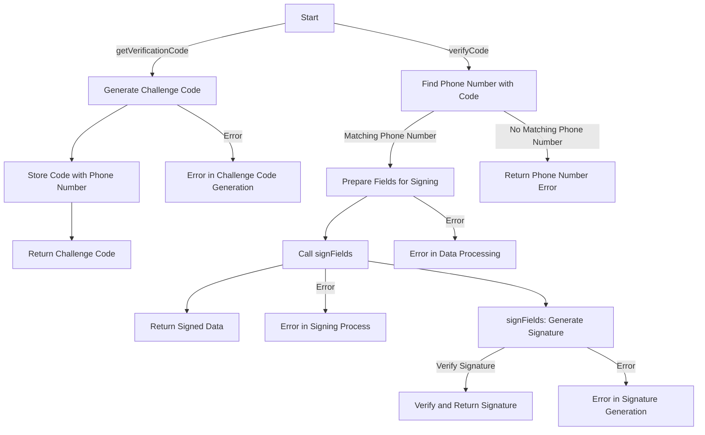
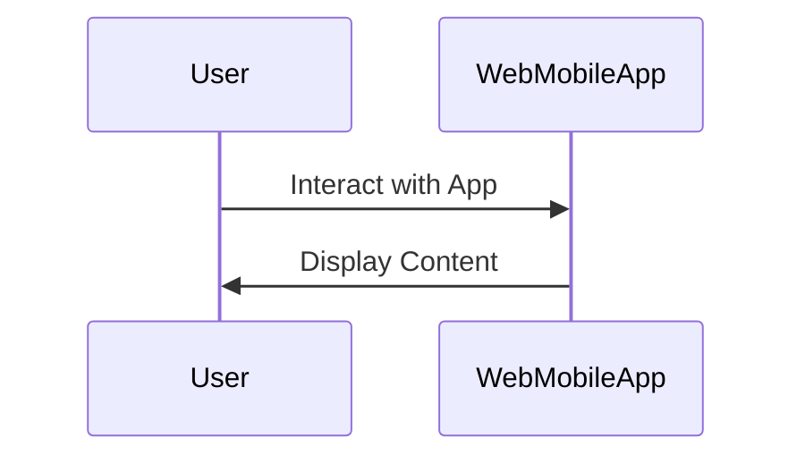
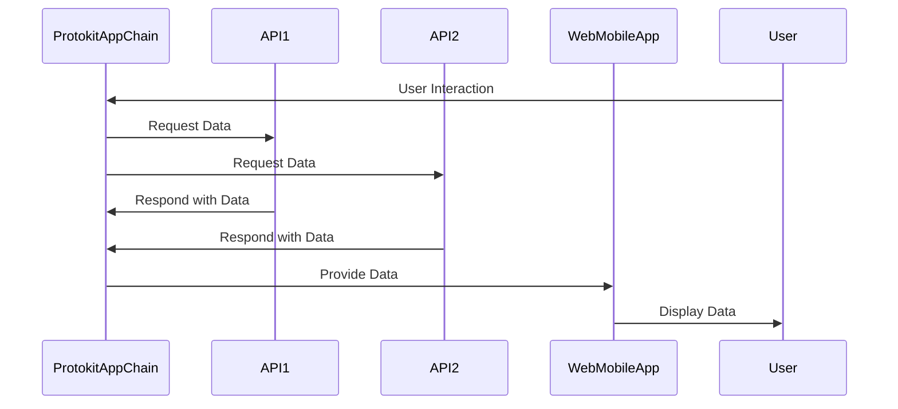

# Project Overview

This document provides an overview of the project architecture and components.

## System Components

### Protokit App Chain

### Disaster API 

### Phone Number api

### Web/Mobile App

### Interaction Between Components

## Disaster API Overview

The Disaster API, built with NestJS, provides disaster-related responses and potential compensation based on the user's location. It fetches disaster data from external sources and uses cryptographic methods for secure responses.

### Endpoints

- **`GET /disaster`**: Determines if a user is in a disaster-affected region using their IP and session ID. It fetches external disaster data, verifies against set criteria, and returns a digitally-signed response.

### Core Functions

- **`getDisaster`**: Checks for disasters in the user's location, prepares a response with session and disaster details, and signs it for security.
- **`getCountryCode`**: Retrieves the user's country from their IP address.
- **`signFields`**: Generates a digital signature for the response, ensuring data integrity and authenticity.

## Phone API Overview

The Phone API, created with NestJS, manages phone number verification and authentication.

### Endpoints

- **`GET /verificationcode`**: Initiates phone verification by generating and storing a challenge code for a given phone number.
- **`GET /verifycode`**: Verifies the received challenge code against the stored one, and generates a signed response for successful matches.

### Core Functions

- **`getVerificationCode`**: Generates a verification code for a phone number.
- **`verifyCode`**: Checks the verification code and returns a signed response upon successful validation.
- **`signFields`**: Creates a digital signature using the user's session data and Mina Signer client.