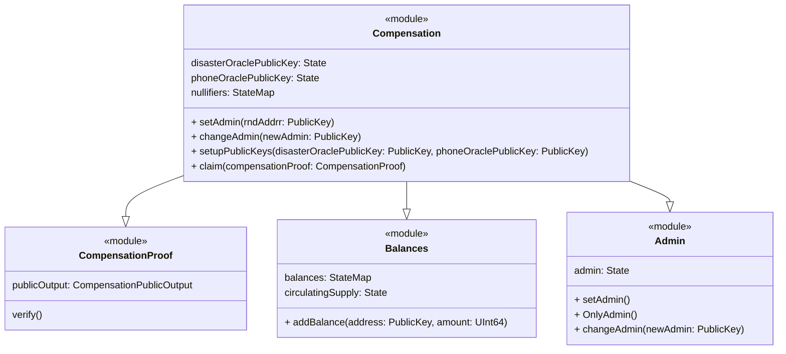
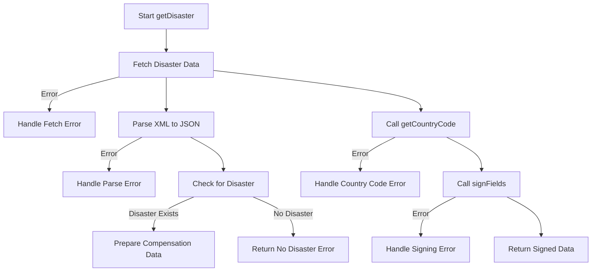
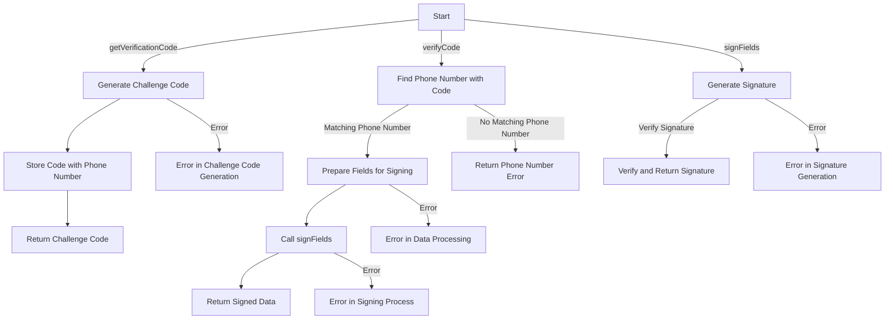
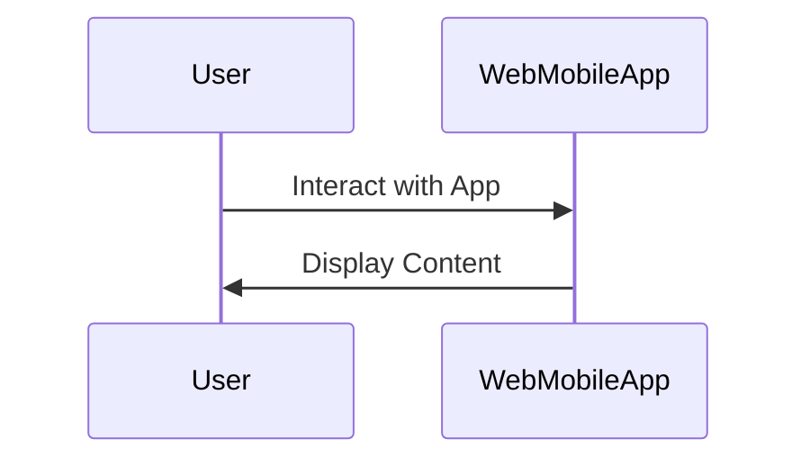
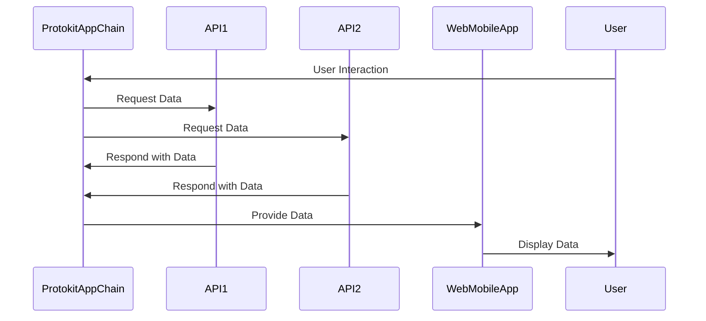

# Project Overview

This document provides an overview of the project architecture and components.

## System Components

### Protokit App Chain

### Disaster API 

### Phone Number api

### Web/Mobile App

### Interaction Between Components

## API 1

### API 1 Overview

API 1 provides...

### Endpoints

- `/endpoint1`: Description of endpoint 1.
- `/endpoint2`: Description of endpoint 2.

## API 2

### API 2 Overview

API 2 provides...

### Endpoints

- `/endpoint3`: Description of endpoint 3.
- `/endpoint4`: Description of endpoint 4.
